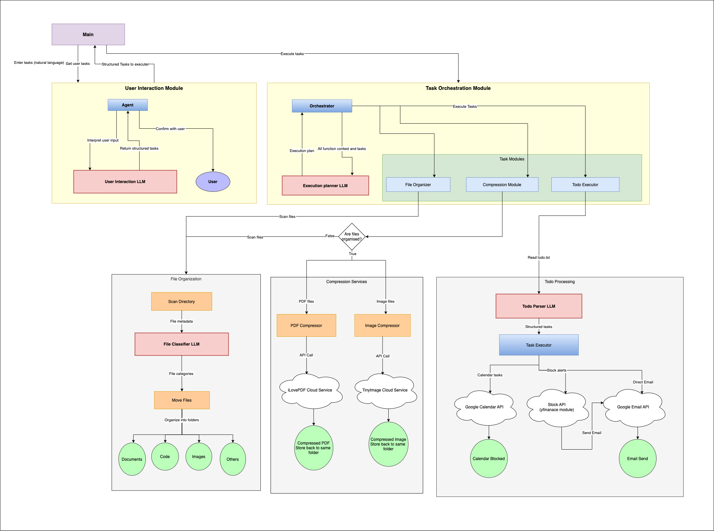

# Intelligent File Organization and Task Automation System

## A Modular LLM-Orchestrated Automation Platform



## Introduction

This capstone project demonstrates the integration of AI-powered language models as function callers and workflow orchestrators. The system is built with three distinct functionalities:

1. **Intelligent File Organization**: Automatically categorizes files into Documents, Images, Code, and Others directories based on LLM-powered file classification.
2. **Smart Compression**: Identifies and compresses PDF documents and image files using external services while maintaining organized folder structures.
3. **Todo Task Automation**: Parses natural language tasks from a todo.txt file and executes them as:
   - Email reminders
   - Calendar invites
   - Stock price alerts

The system showcases advanced software engineering concepts including modular design, LLM orchestration, external API integration, and task automation.

## Architecture

The system follows a layered architecture:

### 1. User Input and File System Layer
- Manages file ingestion, folder contents, and todo.txt file processing
- Provides the primary data source for the system

### 2. Processing and Orchestration Layer
- **LLM Instances**:
  - File Classification LLM: Categorizes files based on names and extensions
  - Todo.txt Parsing LLM: Extracts structured tasks from natural language
  - Orchestrator LLM: Plans and coordinates task execution
- **Python Modules**:
  - Independent modules for file operations, API integrations, and task execution
  - Each module is exposed as a callable function for modular execution

### 3. External Services Layer
- **Compression Services**:
  - ILovePDF API for PDF compression
  - TinyPNG API for image compression
- **Notification Services**:
  - Gmail SMTP for email delivery
  - Google Calendar API for scheduling events
- **Stock Data Provider**:
  - Yahoo Finance (yfinance) for real-time stock information

## LLM Integration

This project leverages Google's Gemini LLM models as intelligent agents:

- **Gemini 1.5 Flash**: Used for efficient inference across all LLM tasks
- **Configuration**: API keys stored in environment variables for secure access
- **Prompt Engineering**: Carefully crafted prompts for specific task interpretation

## External API Integration

The system integrates with several external services:

1. **ILovePDF** - PDF compression service with comprehensive API
2. **TinyPNG** - Image optimization service with programmatic access
3. **Gmail SMTP** - Email delivery for task notifications and reminders
4. **Google Calendar API** - Calendar event creation and invitation management
5. **Yahoo Finance (yfinance)** - Real-time stock data retrieval
6. **Google Gemini API** - Advanced language model for intelligent orchestration

## Setup and Installation

### Prerequisites
- Python 3.8+
- Google Gemini API key
- Accounts for TinyPNG and ILovePDF
- Google account for Gmail and Calendar integration

### Installation

1. **Clone the repository:**
   ```bash
   git clone <repository-url>
   cd intelligent-file-task-automation
   ```

2. **Create and activate a virtual environment:**
   ```bash
   python -m venv venv
   source venv/bin/activate  # On Windows: venv\Scripts\activate
   ```

3. **Install dependencies:**
   ```bash
   pip install -r requirements.txt
   ```

4. **Create a `.env` file with your API keys:**
   ```plaintext
   # Compression APIs
   PDF_COMPRESSION_API_KEY_PUBLIC=your_pdf_api_key_public
   PDF_COMPRESSION_API_KEY_SECRET=your_pdf_api_key_secret
   IMAGE_COMPRESSION_API_KEY=your_image_api_key
   
   # Google Services
   GMAIL_USER=your_gmail_address
   GMAIL_PASS=your_app_password  # Generate from Google Account
   
   # LLM API
   GEMINI_API_KEY=your_gemini_api_key
   ```

5. **Set up Google Calendar API credentials:**
   - Download your `credentials.json` from Google Cloud Console
   - Place in the project root directory

## Usage

### Running the Application

Start the agent with:
```bash
python main.py
```

The interactive agent will:
1. Prompt you to select tasks (organize files, compress files, run todo tasks)
2. Ask for the target folder location
3. Execute the tasks with LLM-powered orchestration

### Todo Task Format

The system recognizes these todo.txt formats:

1. **Email reminders:**
   ```plaintext
   send this email Test Email \n\nDear User,\n\nThis is a test email and a gentle reminder to complete task so and so.\n\nBest,\nSystem via email to user@example.com
   ```

2. **Calendar invites:**
   ```plaintext
   Add a calendar invite for Team meeting for tomorrow i.e. 2025-02-25 at 11 AM IST and share it with user@example.com
   ```

3. **Stock alerts:**
   ```plaintext
   Share the stock price of NVDA every day at 9 AM via email to user@example.com
   ```

## Project Structure
```
capstone_project/
├── My_Folder/                  # User's working directory (created during execution)
│   ├── Files/                  # Default location for unorganized files
│   │   ├── todo.txt            # User's todo tasks file
│   │   └── ...                 # Other user files to be organized
│   ├── Documents/              # Created by organizer
│   ├── Images/                 # Created by organizer
│   ├── Code/                   # Created by organizer
│   └── Others/                 # Created by organizer
├── src/
│   ├── llm/
│   │   ├── agent.py            # Lines 1-102 from agent.py context
│   │   ├── orchestrator.py     # Lines 1-192 from orchestrator.py context
│   │   └── ...                 # Other LLM modules
│   ├── file_organizer/
│   │   ├── organizer.py        # Lines 1-179 from organizer.py context
│   │   └── ...                 # File classification logic
│   ├── compression/
│   │   ├── pdf_compressor.py   # Referenced in orchestrator.py lines 133-134
│   │   └── image_compressor.py # Referenced in orchestrator.py lines 134-135
│   ├── todo/                   # Contains todo task execution logic
│   └── ...                     # Other modules
├── main.py                     # Lines 1-35 from main.py context
├── requirements.txt
├── todo.txt                    # Sample todo file
└── .env                        # Environment variables for API keys
```

## Future Enhancements

Potential extensions to this project:

1. **Web Interface**: Create a user-friendly web dashboard for task management
2. **Advanced Scheduling**: Add recurring tasks with complex scheduling patterns
3. **Custom Tasks**: Allow users to define custom task types with plugins
4. **Bulk Processing**: Optimize for large-scale file operations
5. **Multi-User Support**: Add authentication and per-user configurations
6. **Feedback Loop**: Implement a learning mechanism to improve LLM performance

**Note**: This project is a demonstration of LLM orchestration concepts and integrates with external APIs that may require paid subscriptions for production use.